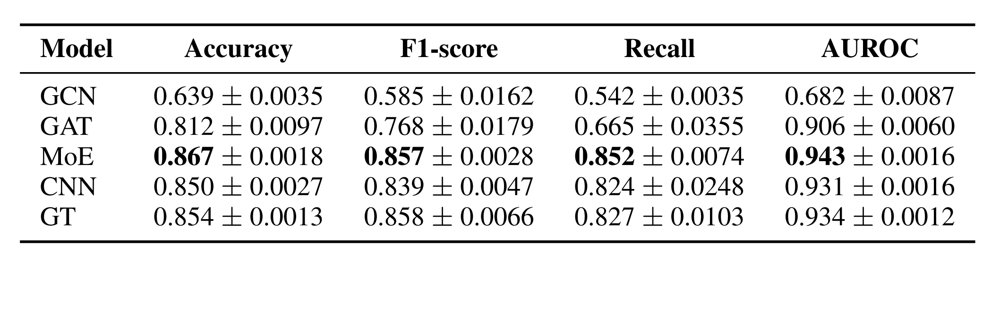

# Transformer for DarkPhoton Identification
A repository for ivestigating Dark Photon identifications with Transformer architectures

## TL;DR
Dark photons are hypothetical beyond-Standard-Model particles whose calorimeter signatures are sparse, irregular, and difficult to distinguish from QCD background. We represent jet energy deposits as graphs and apply Graph Transformer architectures — extended with a Mixture of Experts (MoE) mechanism — to identify displaced dark-photon decays in the ATLAS calorimeter, benchmarking against CNN, GCN, and GAT baselines.

## Data 
The dataset is based on publicly released Monte Carlo simulations of the ATLAS detector, accessible via [HEPData](https://www.hepdata.net/record/ins2728869). A preprocessed version used for training is available at [this link](https://github.com/alessiodevoto/darkphoton)

## Metrics 
We train and evaluate the model and compare it with other architectures (Multilayer perception, Graph Convolutional Neural network, Graph Transformer and Convolutional Neural Network). The results are shown in the table \

## Visualization of some physical quantities
We analyse physics-motivated variables across prediction categories (TP, TN, FP, FN) to interpret model behaviour.

